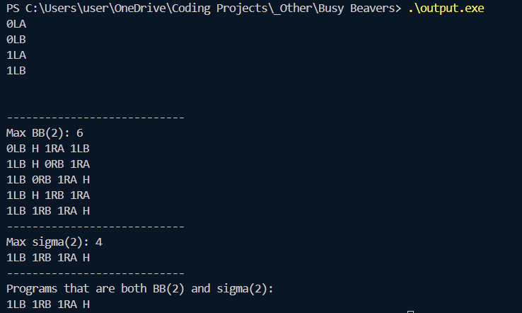
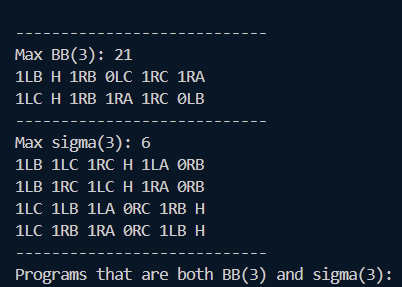

# Busy Beavers
N=2 and N=3

BB(n) = max steps for n internal states

Σ(n) = max 1s written

Code notes:
- Brute forced and not particularly efficiently
- Only searching tables with transition[A][0] = \_L\_ to save time, to get every possible table, include the reverse (all L's to R's and vice versa)
- Machine starts with state A, reading 0.

## N=2
### Image

### BB(2) = 6
<table>
  <tr>
  <td>

|   |  A  |  B  |
|:-:|:---:|:---:|
| 0 | 0LB | 1RA |
| 1 |  H  | 1LB |

</td>
<td>

|   |  A  |  B  |
|:-:|:---:|:---:|
| 0 | 0RB | 1LA |
| 1 |  H  | 1RB |

</td>
</tr>
<tr>
<td>

|   |  A  |  B  |
|:-:|:---:|:---:|
| 0 | 1LB | 0RB |
| 1 |  H  | 1RA |

</td>
<td>

|   |  A  |  B  |
|:-:|:---:|:---:|
| 0 | 1RB | 0LB |
| 1 |  H  | 1LA |

</td>
</tr>
<tr>
<td>

|   |  A  |  B  |
|:-:|:---:|:---:|
| 0 | 1LB | 1RA |
| 1 | 0RB |  H  |

</td>
<td>

|   |  A  |  B  |
|:-:|:---:|:---:|
| 0 | 1RB | 1LA |
| 1 | 0LB |  H  |

</td>
</tr>
<tr>
<td>

|   |  A  |  B  |
|:-:|:---:|:---:|
| 0 | 1LB | 1RB |
| 1 |  H  | 1RA |

</td>
<td>

|   |  A  |  B  |
|:-:|:---:|:---:|
| 0 | 1RB | 1LB |
| 1 |  H  | 1LA |

</td>
</tr>
<tr>
<td>

|   |  A  |  B  |
|:-:|:---:|:---:|
| 0 | 1LB | 1RA |
| 1 | 1RB |  H  |

</td>
<td>

|   |  A  |  B  |
|:-:|:---:|:---:|
| 0 | 1RB | 1LA |
| 1 | 1LB |  H  |

</td>
</tr>
</table>

### Σ(2) = 4
<table>
<tr>
<td>

|   |  A  |  B  |
|:-:|:---:|:---:|
| 0 | 1LB | 1RA |
| 1 | 1RB |  H  |

</td>
<td>

|   |  A  |  B  |
|:-:|:---:|:---:|
| 0 | 1RB | 1LA |
| 1 | 1LB |  H  |

</td>
</tr>
</table>

### Machines with 2 internal states that are both BB(2) and Σ(2)
<table>
<tr>
<td>

|   |  A  |  B  |
|:-:|:---:|:---:|
| 0 | 1LB | 1RA |
| 1 | 1RB |  H  |

</td>
<td>

|   |  A  |  B  |
|:-:|:---:|:---:|
| 0 | 1RB | 1LA |
| 1 | 1LB |  H  |

</td>
</tr>
</table>

## N=3
### Image

### BB(3) = 21
<table>
  <tr>
  <td>

|   |  A  |  B  |  C  |
|:-:|:---:|:---:|:---:|
| 0 | 1LB | 1RB | 1RC | 
| 1 |  H  | 0LC | 1RA | 

</td>
<td>

|   |  A  |  B  |  C  |
|:-:|:---:|:---:|:---:|
| 0 | 1RB | 1LB | 1LC | 
| 1 |  H  | 0RC | 1LA | 

</td>
</tr>
</table>

### Σ(3) = 6
<table>
<tr>
<td>

|   |  A  |  B  |  C  |
|:-:|:---:|:---:|:---:|
| 0 | 1LB | 1RC | 1LA |
| 1 | 1LC |  H  | 0RB |

</td>
<td>

|   |  A  |  B  |  C  |
|:-:|:---:|:---:|:---:|
| 0 | 1RB | 1LC | 1RA |
| 1 | 1RC |  H  | 0LB |

</td>
</tr>
<tr>
<td>

|   |  A  |  B  |  C  |
|:-:|:---:|:---:|:---:|
| 0 | 1LB | 1LC | 1RA |
| 1 | 1RC |  H  | 0RB |

</td>
<td>

|   |  A  |  B  |  C  |
|:-:|:---:|:---:|:---:|
| 0 | 1RB | 1RC | 1LA |
| 1 | 1LC |  H  | 0LB |

</td>
</tr>
<tr>
<td>

|   |  A  |  B  |  C  |
|:-:|:---:|:---:|:---:|
| 0 | 1LC | 1LA | 1RB |
| 1 | 1LB | 0RC |  H  |

</td>
<td>

|   |  A  |  B  |  C  |
|:-:|:---:|:---:|:---:|
| 0 | 1RC | 1RA | 1LB |
| 1 | 1RB | 0LC |  H  |

</td>
</tr>
<tr>
<td>

|   |  A  |  B  |  C  |
|:-:|:---:|:---:|:---:|
| 0 | 1LC | 1RA | 1LB |
| 1 | 1RB | 0RC |  H  |

</td>
<td>

|   |  A  |  B  |  C  |
|:-:|:---:|:---:|:---:|
| 0 | 1RC | 1LA | 1RB |
| 1 | 1LB | 0LC |  H  |

</td>
</tr>
</table>

### Machines with 3 internal states that are both BB(3) and Σ(3)
None?
